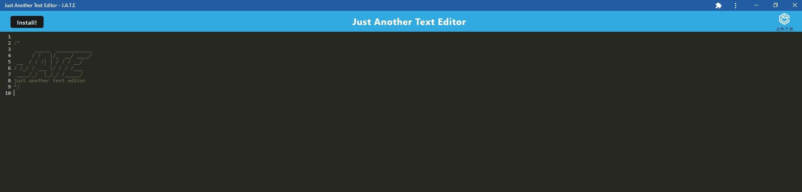
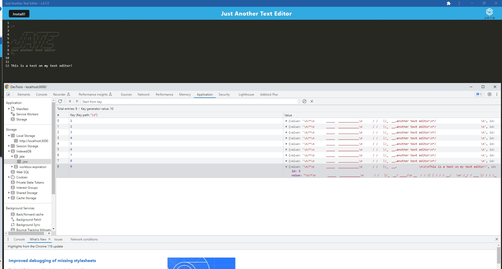

# pwa-text-editor

## Description

This program is a note taker that allows you to take notes and save them! On top of that, you can install this note taker as an application onto your computer. If you click install at the top left, you're able to install this application on your computer, and everytime you click install after that, you're able to save your text editor that saves into the indexedDB!

## Installation

You can install the tech-blog application on github here

https://github.com/Rockojoe2/pwatexteditor

You can visit the deployed website using Heroku here!

(heroku site here later)

## Credits
UTA class folder

Worked with classmates May Pham (https://github.com/mayphamx) and Mica Villanueva (https://github.com/micavilla) 

## License

MIT License

---